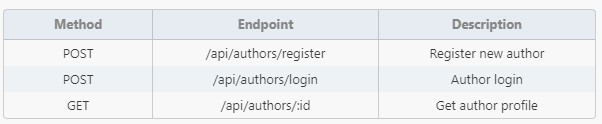
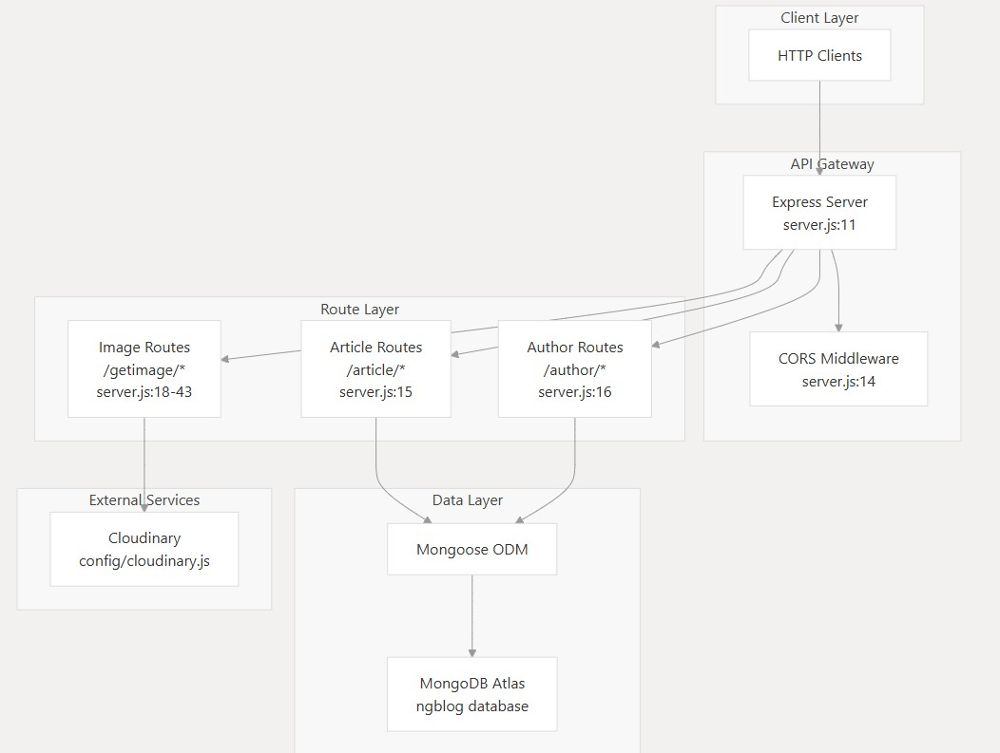
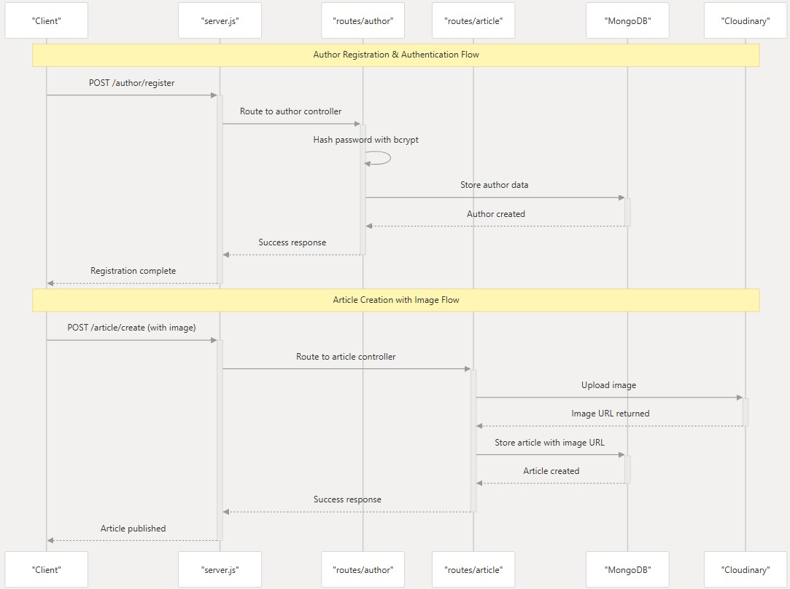
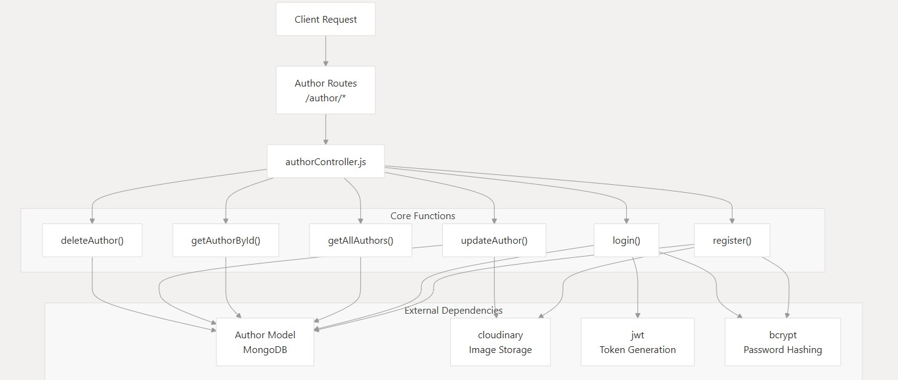
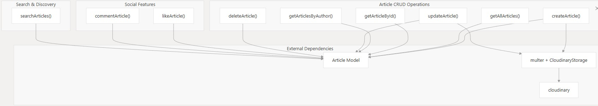
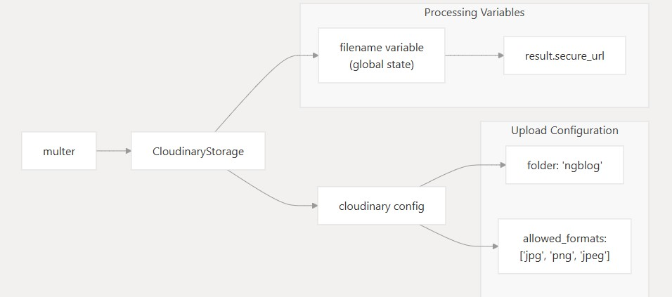
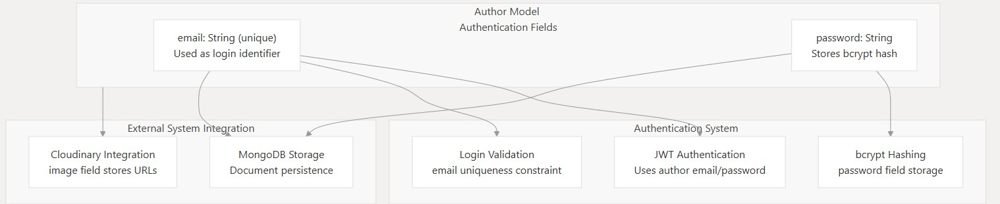
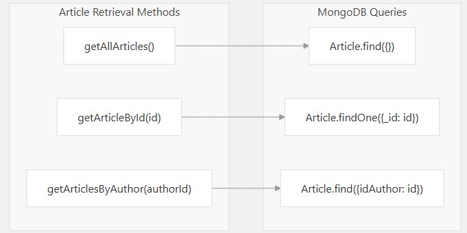

# Blog Backend API


MEAN stack blog backend handling articles, authors, authentication, and media uploads.

## Project Structure
```
# Blog Backend API


backend/
├── config/           # Configuration files
│   ├── cloudinary.js # Cloudinary media config
│   └── connect.js    # MongoDB connection
├── controllers/      # Business logic
│   ├── articleController.js
│   └── authorController.js
├── models/           # MongoDB schemas
│   ├── article.js
│   └── author.js
├── routes/           # API endpoints
│   ├── article.js
│   └── author.js
└── server.js         # Entry point
```

## Features
- RESTful API endpoints
- JWT authentication
- Role-based access control
- MongoDB data modeling
- Cloudinary media uploads
- Error handling middleware

## Setup
1. Install dependencies:
```bash
npm install
```

2. Set up environment variables:
Create a .env file in the root directory and add the following:
```bash
PORT=3000
MONGODB_URI=your_mongodb_uri
JWT_SECRET=your_jwt_secret
CLOUDINARY_CLOUD_NAME=your_cloudinary_cloud_name
CLOUDINARY_API_KEY=your_cloudinary_api_key
CLOUDINARY_API_SECRET=your_cloudinary_api_secret
```

3. Start the server:
```bash
npm start
```
## Configuration
Configure environment (.env):

## API Endpoints
### Articles


### Authors


## Example Request
```
POST /api/articles
Content-Type: multipart/form-data
Authorization: Bearer <token>

title=Example&content=Test&image=@image.jpg
```

## Error Handling
- Custom error handling middleware
- Error responses with appropriate status codes

## Middleware
- Authentication middleware
- Role-based authorization middleware

## System architecture
The ngblog-backend follows a layered architecture pattern with clear separation between the API layer, business logic, data access, and external services.

the system architecture supports horizontal scaling through its stateless design using JWT authentication and cloud-based services for both database (MongoDB Atlas) and file storage (Cloudinary). The modular route structure allows for independent development and testing of author management and article management features.



## Core Components

The system consists of several key components that work together to provide blog functionality:


## Key System Workflows

The system supports two primary workflows that encompass the main business logic:

- Author Management
- Article Management



## Data Model
The system uses a MongoDB data model with two main entities:

- Author: Represents an author with details like name, email, and password.


- Article: Represents a blog article with details like title, content, author, and image.



## image Upload Configuration
The system uses Cloudinary for image storage with specific configuration parameters:



## Authentication Integration
The system integrates JWT (JSON Web Tokens) for authentication. Users can register, log in, and access protected routes using JWT tokens.



## CRUD OPERATIONS
The system supports CRUD operations for both authors and articles:

- Create: POST /api/authors, POST /api/articles
- Read: GET /api/authors, GET /api/articles
- Update: PUT /api/authors/:id, PUT /api/articles/:id
- Delete: DELETE /api/authors/:id, DELETE /api/articles/:id





## Security Features
- JWT token authentication
- Password hashing with bcrypt
- Role-based authorization
- Rate limiting
- CORS configuration
## Dependencies
- Express.js - Web framework
- Mongoose - MongoDB ORM
- Cloudinary - Media storage
- JSONWebToken - Authentication
- Bcrypt - Password hashing
## Deployment
Ready for deployment to:

- Heroku
- AWS Elastic Beanstalk
- DigitalOcean App Platform
- Onrender.com